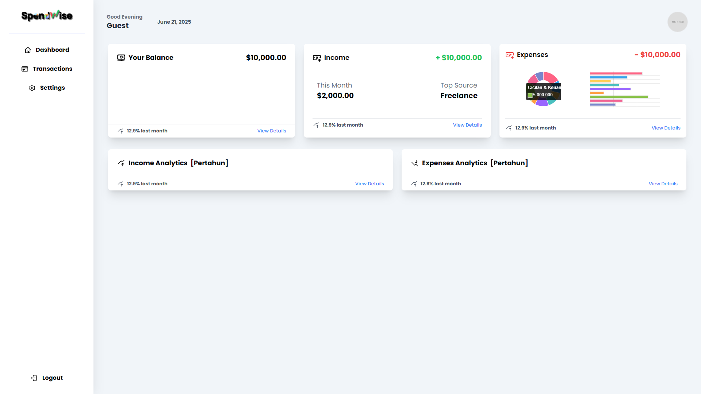

# 🚀 Project Title

A brief description of your project goes here.


---

## 📸 Screenshot



---

## 📦 Features

- 🛠️ Feature One
- 🔐 Feature Two
- 🌐 Feature Three
- 🧪 Unit-tested

---

## 🧠 Technologies Used

- HTML
- CSS / TailwindCSS
- JavaScript
- PHP / MySQL

---

## 🛠️ Installation

```bash
# Clone the repo
git clone https://github.com/XNebule/Financial_Management_Repo.git

# Go into the project folder
cd Financial_Management_Repo.git

# go to built-in terminal / command line
php -S localhost:8080

#go to web type
localhost:8080
```

---

<!-- ## 💡 Examples

### Blockquote
> “Simplicity is the soul of efficiency.” – Austin Freeman

---

### Text Styles

**Bold**  
*Italic*  
~~Strikethrough~~  
`Inline code`

---

### ✅ Checklist

- [x] Feature implemented
- [x] Setup instructions added
- [ ] Write tests
- [ ] Improve UI

---

### 🔗 Useful Links

- [GitHub Markdown Guide](https://guides.github.com/features/mastering-markdown/)
- [Shields.io for Badges](https://shields.io/)
- [Emojipedia](https://emojipedia.org/)

---

## 📊 Table Example

| Feature       | Supported |
|---------------|-----------|
| Dark Mode     | ✅        |
| Responsive UI | ✅        |
| Database Sync | ❌        |

---

## 📂 Folder Structure

```
yourproject/
├── assets/
│   └── images/
├── src/
│   └── index.js
├── .gitignore
├── README.md
└── package.json
```

---

## 🔍 Details Section

<details>
  <summary>Click to see more info</summary>

This project was built using X, Y, and Z technologies to help ABC users solve 123 problems.

</details>

---

## ✨ Contributing

Pull requests are welcome. For major changes, please open an issue first to discuss what you would like to change.

---

## 📜 License

This project is licensed under the MIT License - see the [LICENSE](LICENSE) file for details.

--- -->

## 🙋‍♂️ Author

**Your Name**  
GitHub: [@XNebule](https://github.com/XNebule)  
<!-- Website: [yourwebsite.com](https://yourwebsite.com) -->
